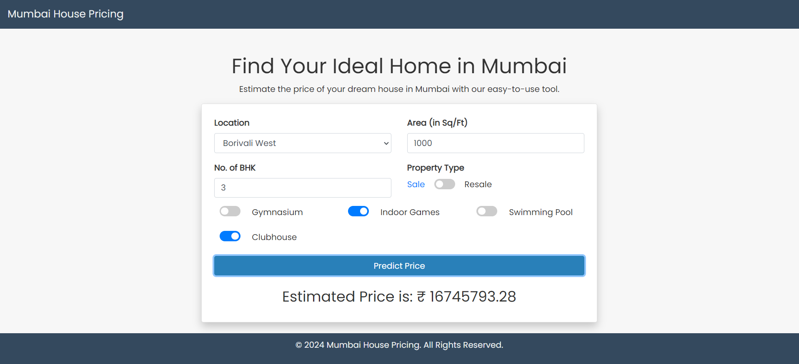
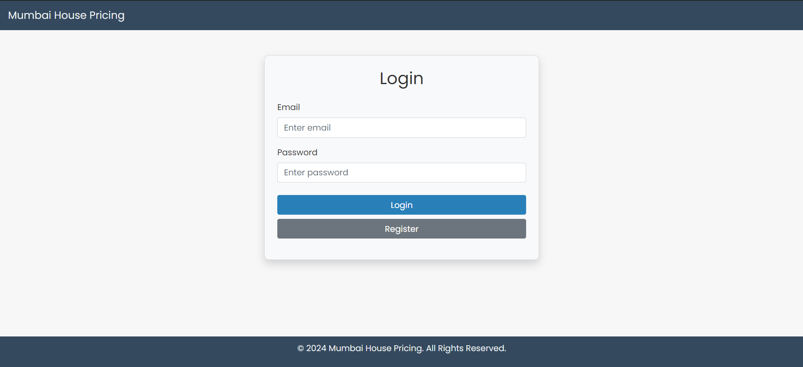
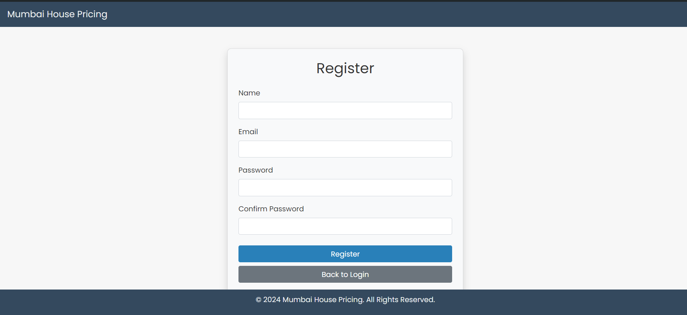

---

# Real Estate Price Prediction Web Application

  

This project is a Flask web application that predicts real estate prices based on various input features like location, area, number of bedrooms, and several amenities. The application uses a machine learning model to make predictions, and the model is trained using a dataset of real estate properties.

## Table of Contents

- [Overview](#overview)
- [Features](#features)
- [Technologies Used](#technologies-used)
- [Setup Instructions](#setup-instructions)
- [Dataset](#dataset)
- [Machine Learning Model](#machine-learning-model)
- [Flask Application](#flask-application)
- [Screenshots](#screenshots)
- [Deployment](#deployment)
- [License](#license)
- [Acknowledgements](#acknowledgements)

## Overview

This web application allows users to predict the price of a property by entering details like location, area, number of bedrooms, and availability of amenities such as a gym, clubhouse, swimming pool, etc. The backend is powered by a machine learning model trained on a real estate dataset, and the front-end is built using HTML and Bootstrap.

## Features

- **User Authentication**: Users can register and log in to access the prediction feature.
- **Price Prediction**: Predicts real estate prices based on user inputs.
- **Data Visualization**: Visualizations to understand the relationship between different features and prices.
- **Responsive Design**: The web interface is responsive and works on all screen sizes.

## Technologies Used

- **Python**: Programming language used for backend logic.
- **Flask**: Web framework used to build the web application.
- **SQLAlchemy**: ORM for database management.
- **WTForms**: Form handling in Flask.
- **SQLite**: Database used for user management.
- **scikit-learn**: Machine learning library used for model training.
- **pandas, numpy**: Data manipulation and analysis.
- **HTML, CSS, Bootstrap**: Frontend design and styling.

## User Authetication

  

  

## Dataset

The dataset used for training the machine learning model is a collection of real estate listings, which includes features like:

- **Area**: The size of the property in square feet.
- **Location**: The locality where the property is located.
- **Number of Bedrooms**: The number of bedrooms in the property.
- **Price**: The price of the property (target variable).
- **Amenities**: Availability of amenities like gym, clubhouse, swimming pool, etc.

## Machine Learning Model

### Model Training

The machine learning model was trained using the following steps:

1. **Data Preprocessing**:
   - Handled missing values.
   - Encoded categorical variables.
   - Removed outliers.

2. **Feature Engineering**:
   - Selected the most relevant features using `SelectKBest`.

3. **Model Selection**:
   - Trained various models including Linear Regression, Polynomial Regression, SVR, Decision Tree, Random Forest, Gradient Boosting, and KNN.
   - Evaluated models using metrics like R2 score, Mean Absolute Error (MAE), and Mean Squared Error (MSE).

4. **Model Saving**:
   - The best model (Random Forest Regressor) was saved as a compressed pickle file for deployment.

### Model Deployment

The trained model is loaded into the Flask application and used to predict property prices based on user input.

## Flask Application

The Flask application consists of the following components:

- **User Authentication**:
  - Users can register, log in, and access the prediction features.
  - Passwords are hashed using bcrypt.

- **Prediction Route**:
  - Users enter property details, and the application returns the predicted price.

- **Data Visualization**:
  - Visualizations are included to show data distribution and feature correlations.

## Screenshots

*Include screenshots of your application here.*

- **Home Page**:
  

- **Login Page**:
  

- **Prediction Page**:
  

## Deployment

The application can be deployed on platforms like PythonAnywhere, Heroku, or any other cloud service that supports Flask.

To deploy on PythonAnywhere:

1. **Upload the files**: Upload all your project files including `app.py`, `model.pkl`, `area_key.json`, and `templates/` to PythonAnywhere.
2. **Set up the virtual environment**: Create a virtual environment and install dependencies.
3. **Configure WSGI**: Point the WSGI file to your Flask application.
4. **Reload the web app**: Reload the web app to apply changes.

## Acknowledgements

- [Flask Documentation](https://flask.palletsprojects.com/)
- [scikit-learn Documentation](https://scikit-learn.org/)
- [Bootstrap](https://getbootstrap.com/)
- [PythonAnywhere](https://www.pythonanywhere.com/)

